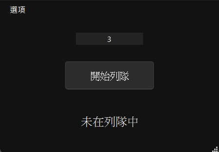

# LolAudit

**《英雄聯盟 (League of Legends)》** 客戶端的輔助工具，提供自動接受對戰、重新列隊與簡易 UI 操作，方便玩家在排位或一般遊戲中減少重複性操作。

## [直接下載](https://api.github.com/repos/vaz1306011/LolAudit/releases/latest)

## 功能特色 ✨

- **自動接受對戰**：偵測到配對成功後自動點擊接受。
- **自動重新列隊**：列隊超過預期時間自動重新列隊。
- **延遲接受設定**：可自訂接受對戰的延遲秒數。
- **常駐頂端視窗**：可選擇視窗是否保持在最上層。

## 系統需求 📦

- **作業系統**：
  - Windows 10/11
  - macOS
- **Python**：3.10+
- **依賴套件**：
  - [PySide6](https://pypi.org/project/PySide6/)

## 使用截圖

  <tr>
    <td></td>
    <td></td>
  <tr>
  <tr>
    <td></td>
  <tr>
</table>

## 安裝方式 ⚙️

1. 下載專案：
   ```bash
   git clone https://github.com/vaz1306011/LolAudit.git
   cd LolAudit
   ```
2. 建立虛擬環境並安裝依賴：
   ```bash
   pipenv install
   ```
3. 執行程式：
   ```bash
   python lol_audit.pyw
   ```

## 使用方式 🖥️

- **開始列隊**：點擊「開始列隊」按鈕即可啟動自動配對流程。
- **停止列隊**：配對中時可隨時停止。
- **設定項目**：
  - `接受延遲`：延遲自動接受的秒數。
  - `自動接受`：是否自動接受比賽。
  - `自動重新列隊`：遊戲結束後是否自動重新排隊。
  - `視窗置頂`：保持 UI 在最上層顯示。

## 注意事項 ⚠️

- 本程式僅作為學術與個人練習用途，使用時可能違反 Riot Games 的服務條款，請自行承擔風險。
- 請勿在正式比賽或競賽環境中使用。
