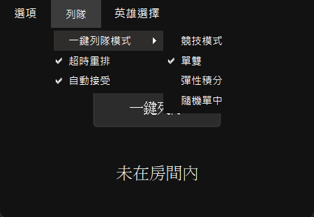
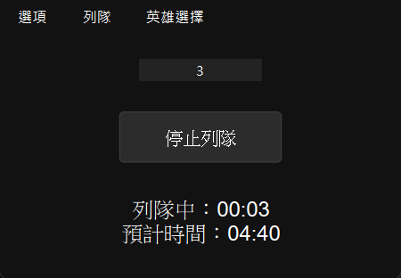
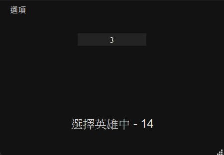

# LolAudit

[中文](README.md) | [English](README_EN.md) | [日本語](README_JP.md)

**《英雄聯盟 (League of Legends)》** 客戶端的輔助工具，提供自動接受對戰、重新列隊與簡易 UI 操作，方便玩家在排位或一般遊戲中減少重複性操作。

## [直接下載](https://github.com/vaz1306011/LolAudit/releases/latest)

## 功能特色 ✨

- **一鍵列隊**：根據設定的模式從大廳一鍵列隊。
- **自動接受對戰**：根據設定時間偵測到配對成功後自動點擊接受。
- **自動重新列隊**：列隊超過預期時間自動重新列隊。
- **選取禁用英雄**：根據上把選擇自動選取禁用英雄。
- **自動鎖角**：時間結束前自動鎖定英雄。

## 系統需求 📦

- **作業系統**：
  - Windows 10/11
  - macOS
- **Python**：3.10+
- **依賴套件**：
  - [PySide6](https://pypi.org/project/PySide6/)

## 使用截圖

  <tr>
    <td></td>
    <td></td>
  <tr>
  <tr>
    <td></td>
  <tr>
</table>

## 安裝方式 ⚙️

1. 下載專案：
   ```bash
   git clone https://github.com/vaz1306011/LolAudit.git
   cd LolAudit
   ```
2. 建立虛擬環境並安裝依賴：
   ```bash
   uv sync
   ```
3. 執行程式：
   ```bash
   python main.py
   ```

## 使用方式 🖥️

- **一鍵列隊**：點擊「一鍵列隊」按鈕，依設定模式開始列隊。
- **停止列隊**：配對中時可隨時停止。
- **設定項目**：
  - `自動接受`：配對成功後依設定時間自動接受。
  - `自動重新列隊`：列隊超過預期時間自動重新列隊。
  - `選取禁用英雄`：根據上把選擇自動選取禁用英雄。
  - `自動鎖角`：時間結束前自動鎖定英雄。

## 注意事項 ⚠️

- 本程式僅作為學術與個人練習用途，使用時可能違反 Riot Games 的服務條款，請自行承擔風險。
- 請勿在正式比賽或競賽環境中使用。
